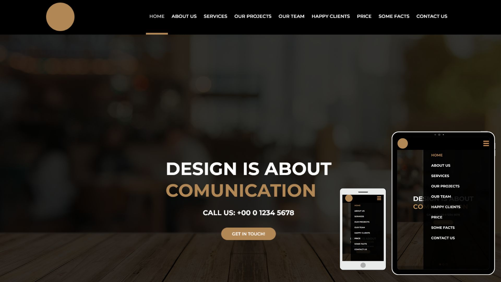

# Poject Awax 🌐
## Layout author: Alexander Bukin 

 
🎓 Project made with the academic objective.

<h1> 
See the site  
    

</h1>

## Tools used 🛠️

- [HTML5](https://developer.mozilla.org/pt-BR/docs/Web/HTML/Element)
- [CSS3](https://developer.mozilla.org/pt-BR/docs/Web/CSS)
- [Java Script](https://developer.mozilla.org/pt-BR/docs/Web/JavaScript)